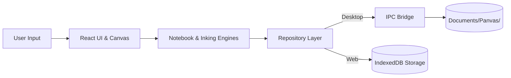

<p align="center">
  
</p>

# Panvas

> **Local-first visual workspace for notes, handwriting, PDFs, and spatial thinking.**

<p align="center">
  <a href="https://github.com/sumitahmed/Panvas/releases/latest">
    
  </a>
  <a href="https://panvas.vercel.app/app">
    
  </a>
  <a href="https://panvas.vercel.app/">
    
  </a>
</p>

<p align="center">
  
  
  
  
</p>

---


<p align="center">
  <em>Think. Sketch. Write. Build.</em><br />
  A unified digital workspace combining structured notebook hierarchy, pressure-aware vector ink, PDF annotation, and an infinite canvas — keeping all data stored locally on your device.
</p>

---

## Why Panvas?

Most note apps force an annoying compromise: you either get rigid linear documents locked in someone else's cloud, or an unconstrained whiteboard that gets messy fast.

Panvas bridges structured notebooks and infinite canvases into a single, distraction-free environment. You get the depth of hierarchical notebooks with rich text and vector inking, alongside a spatial diagramming canvas and PDF workbench — with zero mandatory cloud accounts, zero telemetry lock-in, and full ownership of your local files.

---

## Features

✦ **Structured notebooks**: Full workspace hierarchy (`Workspace → Folder → Notebook → Section → Page`) with rich-text editing, paper templates, and multi-layer drawing.  
✦ **Natural handwriting & ink**: Pressure-aware vector pen engine, palm rejection, stroke smoothing, smart erasing, and precision ruler tools.  
✦ **PDF annotation**: In-place PDF viewer with vector ink markup, text highlights, and high-fidelity annotated PDF export powered by `pdf-lib`.  
✦ **Infinite visual canvas**: Spatial diagramming powered by Excalidraw, integrated with custom Panvas cards and visual note objects.  
✦ **Sticky notes / images / voice notes**: Floating sticky notes, image cropping and placement, and embedded voice notes pinned directly to pages.  
✦ **Search / trash / backup**: Fast client-side search across titles and page contents, soft-delete trash recovery, and full JSON workspace backup export/import.  
✦ **Local-first storage**: Desktop files live directly on your disk in human-readable JSON and binary assets.

| Structured Notebooks & Ink | Spatial Canvas |
|:---:|:---:|
|  |  |
| **PDF Annotation Workbench** | **Ink Gestures & Stationery** |
|  |  |

---

## Download

### Windows (Desktop)
- **Panvas v0.1.0 (64-bit)**: Download [`Panvas-0.1.0-Setup.exe`](https://github.com/sumitahmed/Panvas/releases/latest) from the [GitHub Releases](https://github.com/sumitahmed/Panvas/releases) portal.
- **Panvas v0.1.1 (64-bit)**: Download [`Panvas-0.1.1-Setup.exe`](https://github.com/sumitahmed/Panvas/releases/latest) from the [GitHub Releases](https://github.com/sumitahmed/Panvas/releases) portal.
- **SHA-256 Checksum Verification**: Verify the downloaded installer against the official checksum published in `SHA256SUMS.txt`:
  ```powershell
  Get-FileHash Panvas-0.1.0-Setup.exe -Algorithm SHA256
  # Verified SHA-256: 9d4cfcded4e3b76d8880ab4948901de0c56e2595dc793b5eb2433c4430158edd
  Get-FileHash Panvas-0.1.1-Setup.exe -Algorithm SHA256
  # Verified SHA-256: 7c158949c74465bffd8c4f2ca9c753e05dd2401a83427c96b936a0fa2d6d207d
  ```
  *Note: The initial v0.1.0 installer is unsigned while the code signing pipeline is established. If Windows SmartScreen prompts on launch, click "More info" → "Run anyway".*
  *Note: The v0.1.1 installer is unsigned while the code signing pipeline is established. If Windows SmartScreen prompts on launch, click "More info" → "Run anyway".*

### Web
- **Browser App**: Launch [panvas.vercel.app/app](https://panvas.vercel.app/app) to use Panvas directly in Chromium, Firefox, or Safari (stored in origin-scoped IndexedDB).

---

## Local-first by design

Your data stays on your machine:
- **Desktop**: Workspaces, pages, and media attachments are saved directly to `Documents/Panvas/` (or a custom root folder configured in Settings). Writes use an atomic queue with retry logic to avoid corruption.
- **Web**: Workspaces are saved to origin-scoped IndexedDB via Dexie.
- **Cloud Sync**: Google Drive sync is release-gated and disabled by default. When enabled, your local machine remains the primary source of record.

For complete data schemas and persistence flow, see [docs/ARCHITECTURE.md](docs/ARCHITECTURE.md) and [docs/STORAGE_AND_PERSISTENCE.md](docs/STORAGE_AND_PERSISTENCE.md).

---

## Build from source

Prerequisites: **Node.js 20 or 22 LTS**, **npm**, and **Git**.

```bash
# 1. Clone the repository
git clone https://github.com/sumitahmed/Panvas.git
cd Panvas

# 2. Install dependencies
npm ci

# 3. Start local development
# Web / Vite dev server (open http://localhost:5173/app)
npm run dev

# Desktop / Electron app
npm start

# 4. Run tests and type checks
npm run typecheck
npm test
npm run build
```

See [CONTRIBUTING.md](CONTRIBUTING.md) for detailed development workflows and debugging guidelines.

---

## Architecture



The renderer coordinates the user interface and domain logic. Filesystem access is strictly isolated through Electron's `contextBridge` and validated IPC handlers.

Detailed references:
- [docs/ARCHITECTURE.md](docs/ARCHITECTURE.md) — Subsystem boundaries and execution flow
- [docs/DATA_MODEL.md](docs/DATA_MODEL.md) — Entity models and schemas
- [docs/SYSTEM_DESIGN.md](docs/SYSTEM_DESIGN.md) — Inking and canvas coordinate systems

---

## Contributing

Panvas is free, open-source software built for the community. Contributions are very welcome!

- **[Report a Bug](https://github.com/sumitahmed/Panvas/issues/new?template=bug_report.md)** — Found an issue? Let us know with steps to reproduce.
- **[Request a Feature](https://github.com/sumitahmed/Panvas/issues/new?template=feature_request.md)** — Share ideas for improvements or new capabilities.
- **[Contributor Roadmap](docs/CONTRIBUTOR_ROADMAP.md)** — See planned areas where community help is most valuable.
- **[Contributing Guidelines](CONTRIBUTING.md)** — Read before opening pull requests.
- **[Code of Conduct](CODE_OF_CONDUCT.md)** — Our community standards.

---

## Roadmap

- **v0.1.x**: Stability hardening, stylus gesture polish, responsive layout refinements, and test expansion.
- **Future**: Native macOS & Linux packaging, mobile companion app, handwriting recognition enhancements, and additional sync providers (e.g. OneDrive).

Read the detailed roadmap in [docs/ROADMAP.md](docs/ROADMAP.md).

---

## Support Panvas

Panvas is free and open source. If you find Panvas useful, you can support the project by:
- Giving the repository a ⭐ on [GitHub](https://github.com/sumitahmed/Panvas)
- Reporting bugs and suggesting features
- Contributing code, tests, or documentation

*(Note: No financial sponsorship or donation channels are active at this time.)*

---

## Security

Please report security vulnerabilities privately via [GitHub Security Advisories](https://github.com/sumitahmed/Panvas/security/advisories). For our vulnerability disclosure process, see [SECURITY.md](SECURITY.md).

---

## License

Panvas is licensed under the [MIT License](LICENSE).  
Third-party notices and licenses are listed in [THIRD_PARTY_NOTICES.md](THIRD_PARTY_NOTICES.md).
